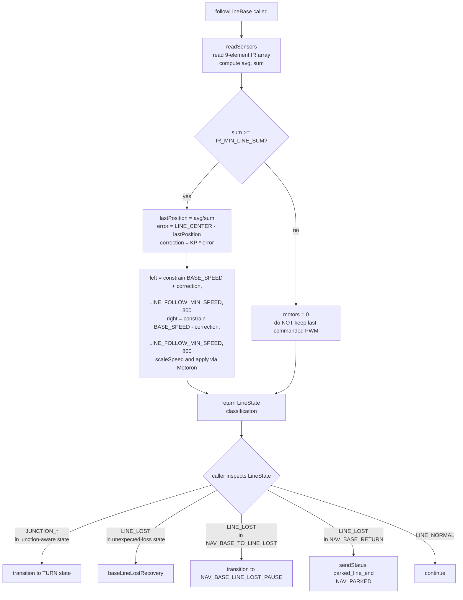
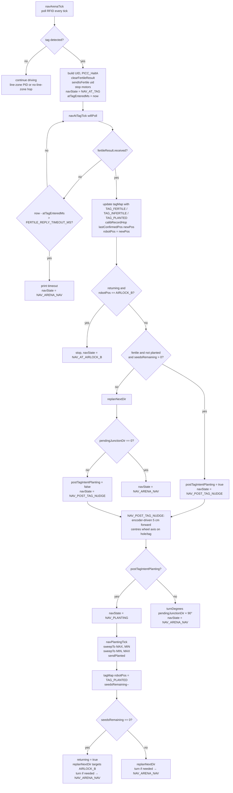
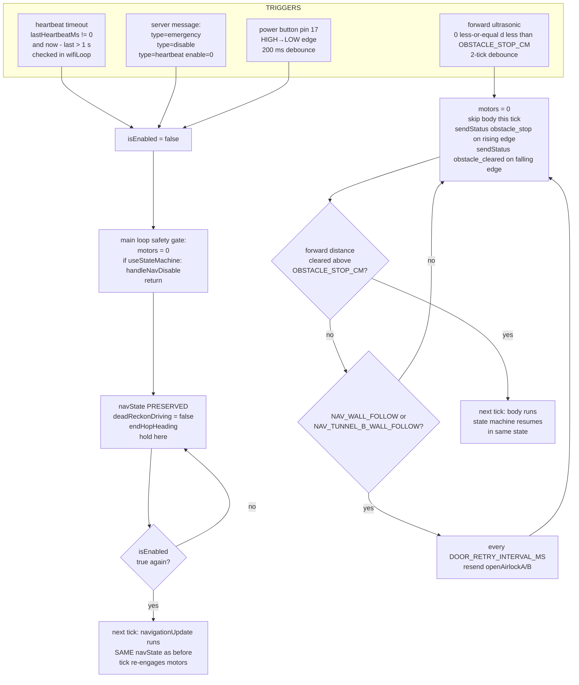
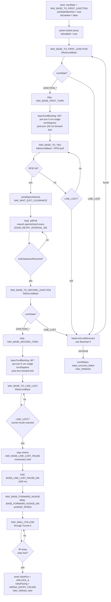
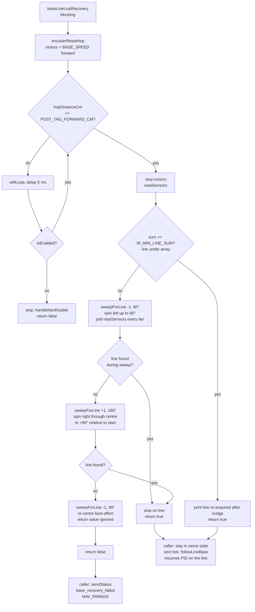
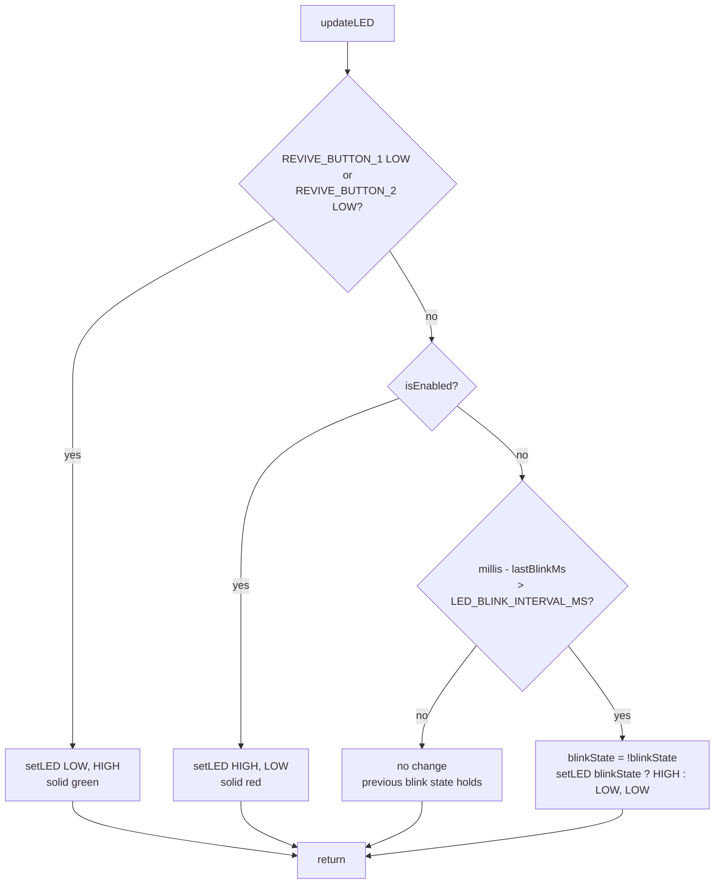
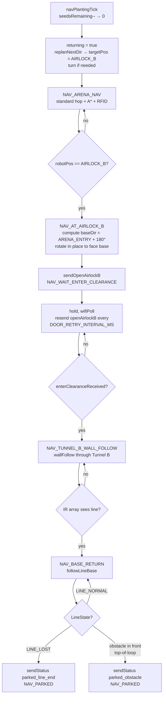
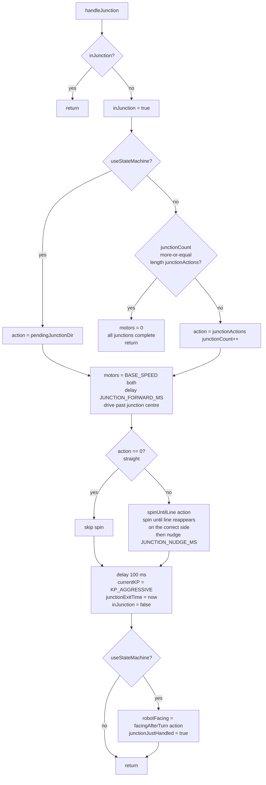
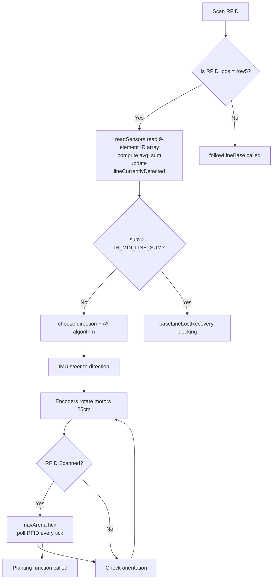

# Flowcharts

Mermaid diagrams for the key control flows. They render on GitHub, GitLab, and most markdown viewers with Mermaid support; the raw source is still readable as plain text otherwise.

## 1. Line following

`followLineBase()` is the state-machine path's line-follow tick. Called from every base line-follow state (`NAV_BASE_TO_FIRST_JUNCTION`, `NAV_BASE_TO_TAG`, `NAV_BASE_TO_SECOND_JUNCTION`, `NAV_BASE_TO_LINE_LOST`, `NAV_BASE_RETURN`) and from `NAV_ARENA_NAV` while in the line zone (`robotPos.row >= LINE_ZONE_MIN_ROW`).

Key behaviors:
- The `else` branch on `sum < IR_MIN_LINE_SUM` stops motors instead of letting the last PWM keep the wheels turning. This prevents drift past the line end.
- `LINE_FOLLOW_MIN_SPEED` (300) is the floor for the slow-wheel side of the PID. Below this the motor stalls and the wheel doesn't actually rotate, just buzzes.
- The legacy `followLine()` (only used in `NAV_LINE_FOLLOW` test mode) still has the older switch-on-LineState shape with `handleJunction()` inline.

## 2. RFID + planting decision

State-machine version: `pollRfidAndQueue → NAV_AT_TAG → NAV_POST_TAG_NUDGE → NAV_PLANTING` (or `→ NAV_ARENA_NAV`).

Key invariants:
- `fertileResult` is *not* cleared in `NAV_AT_TAG`. `NAV_PLANTING` still reads `fertileResult.tagId` to send `sendPlanted`. Clearing happens at the start of the next `pollRfidAndQueue` via `clearFertileResult`.
- The `POST_TAG_FORWARD_CM` (5 cm) nudge is used in three places with identical semantics: post-tag nudge before plant/turn, base junction pre-turn, and base line-lost recovery. Same encoder-based path each time.

## 3. Emergency / kill switch

Four independent triggers can pause or stop the robot.

Behavioral split:
- An `isEnabled` drop **does not change `navState`**. Re-enable resumes whatever state was active before the pause. This is a deliberate change from earlier versions that collapsed to `NAV_DISABLED` + auto-resumed to `NAV_ARENA_NAV`.
- A forward obstacle auto-resumes the moment the obstacle clears (door opens / object moved). This is the door-open path. Same-tick resumption.
- `NAV_BASE_RETURN` is special-cased in the obstacle gate: hitting something in front while returning ends the run (`parked_obstacle` → `NAV_PARKED`).

## 4. Base exit sequence

From button press in the base to arena nav. All the new state-machine work since the original docs.

## 5. Line-lost recovery (base only)

Triggered from `NAV_BASE_TO_FIRST_JUNCTION`, `NAV_BASE_TO_TAG`, `NAV_BASE_TO_SECOND_JUNCTION` when `followLineBase()` returns `LINE_LOST`. **Not** used in `NAV_BASE_TO_LINE_LOST` (line ending is expected) or `NAV_BASE_RETURN` (line ending = parking).

The total angular search range is ±90° from start. Each sweep stops the instant a line appears. `wifiLoop()` is called every iteration so the heartbeat survives a multi-second recovery.

## 6. Status LED priority stack

`updateLED()` runs every tick inside `wifiLoop()`.

Revive buttons (52/53) are the only override. Otherwise the LED is solid red while `isEnabled` is true and blinks red at `LED_BLINK_INTERVAL_MS` while disabled.

## 7. Return-to-base sequence

After the last seed is planted, `returning = true` and `replanNextDir` targets `AIRLOCK_B` (row 6, col 8).

Notes:
- The door-open detection in both tunnel transitions watches the forward ultrasonic, not the clearance message. The clearance flag is set by `onMessage` for verification only.
- `BASE_RETURN` ends on the first of (a) the line ending naturally, or (b) hitting something in front (per the spec: "follow it until no more line or we detect something in front and can't move").

## 8. Junction handling (legacy)

`handleJunction()` is invoked from `followLine()` (legacy `NAV_LINE_FOLLOW` test mode only). The state-machine path uses `baseTurnBlocking()` for base junctions and `NAV_POST_TAG_NUDGE` for arena turns. Both are simpler and don't go through this function.

Kept for the test-mode path and for reference, but the production base-exit and arena flows do not use it.

flowchart TD
    A[handleJunction] --> B{inJunction?}
    B -- yes --> Z[return]
    B -- no --> C[inJunction = true]
    C --> D{useStateMachine?}
    D -- yes --> E[action = pendingJunctionDir]
    D -- no --> F{junctionCount more-or-equal length junctionActions?}
    F -- yes --> G[motors = 0 all junctions complete return]
    F -- no --> H[action = junctionActions junctionCount++]
    E --> I[motors = BASE_SPEED both delay JUNCTION_FORWARD_MS drive past junction centre]
    H --> I
    I --> J{action == 0? straight}
    J -- yes --> K[skip spin]
    J -- no --> L[spinUntilLine action spin until line reappears on the correct side then nudge JUNCTION_NUDGE_MS]
    K --> M[delay 100 ms currentKP = KP_AGGRESSIVE junctionExitTime = now inJunction = false]
    L --> M
    M --> N{useStateMachine?}
    N -- yes --> O[robotFacing = facingAfterTurn action junctionJustHandled = true]
    N -- no --> P[return]
    O --> P

##9. Path planning for second half of arena (Prospective Flowchart)

