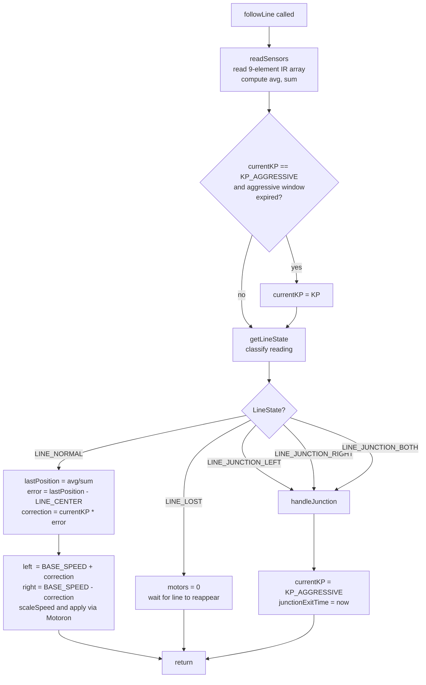
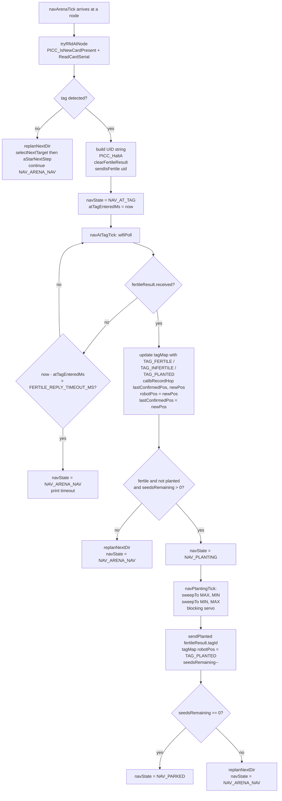
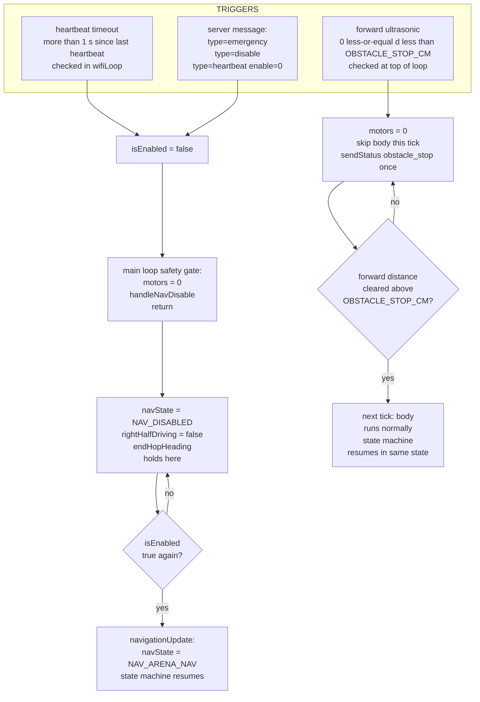
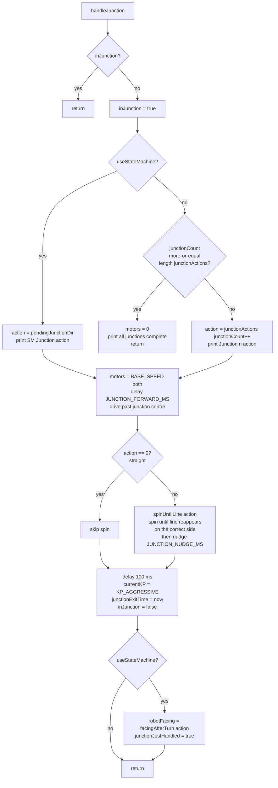

# Flowcharts

Mermaid diagrams for the four key control flows. They render on GitHub, GitLab, and most markdown viewers with Mermaid support; the raw source is still readable as plain text otherwise.

## 1. Line following

`followLine()` is called every tick while in `NAV_LINE_FOLLOW` (legacy test mode) or in `NAV_ARENA_NAV` on the left half of the arena.

Key behavior: after every junction, the PID switches to a more aggressive `KP_AGGRESSIVE` gain for `AGGRESSIVE_DURATION_MS` to recapture the line, then falls back to the normal `KP`.

## 2. RFID + planting decision

State-machine version: the `tryRfidAtNode → NAV_AT_TAG → NAV_PLANTING` chain. Legacy `rfidLoop()` follows the same logic but is blocking inside one function.

Key invariant: `fertileResult` is *not* cleared in `NAV_AT_TAG` — `NAV_PLANTING` still reads `fertileResult.tagId` to send `sendPlanted`. Clearing happens at the start of the next `tryRfidAtNode` via the `clearFertileResult` call inside it.

## 3. Emergency / kill switch

Three independent triggers can stop the robot. Forward-obstacle is the new entry; the others are existing safety paths.

Behavioral split: an `isEnabled` drop forces `NAV_DISABLED` and needs the server to re-enable. A forward obstacle (within 8 cm) auto-resumes the moment the obstacle clears — this is the door-open path. The two paths use different code routes deliberately.

## 4. Junction handling

`handleJunction()` is invoked from `followLine()` when the IR array classifies a junction. The legacy path uses `junctionActions[]`; the state-machine path uses `pendingJunctionDir` from the planner.

Key bits:
- `inJunction` is a re-entrancy guard — `followLine` can fire multiple `LINE_JUNCTION_*` states in a row as the IR array crosses the intersection.
- The `JUNCTION_FORWARD_MS` drive centres the chassis on the junction *before* spinning, so the spin pivots around the intersection rather than the IR array's leading edge.
- `spinUntilLine` is bang-bang with a gyro-tracked max angle (`JUNCTION_MAX_ROT_DEG`, 180°). Uturn (`action == 2`) doesn't have a dedicated break condition — it spins to max and bails.
