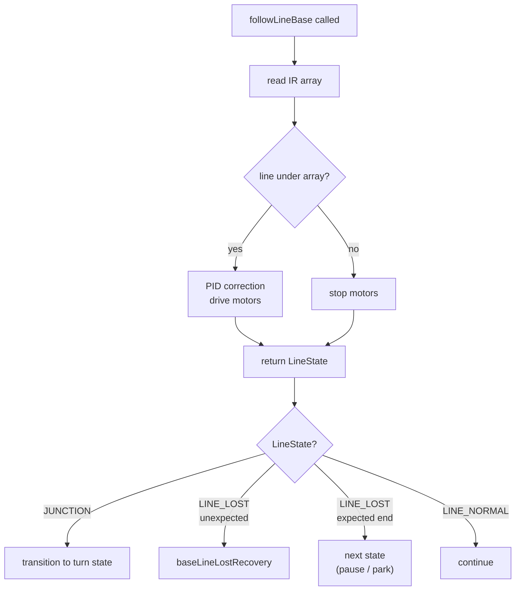
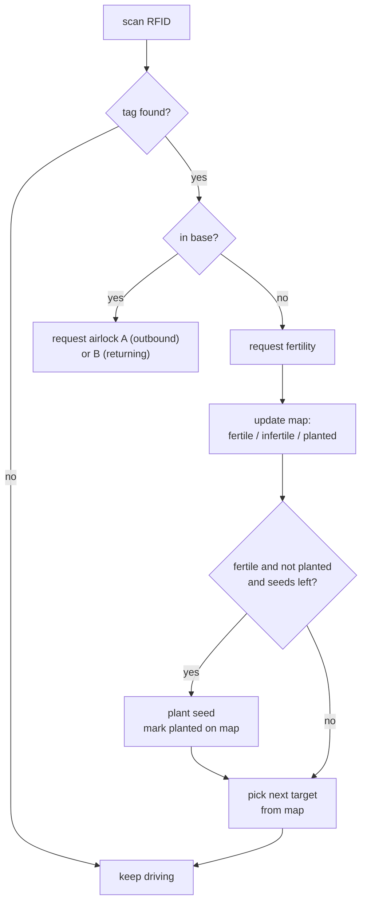
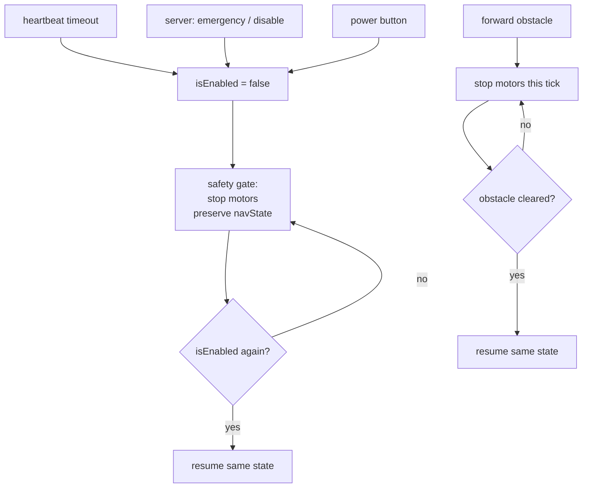
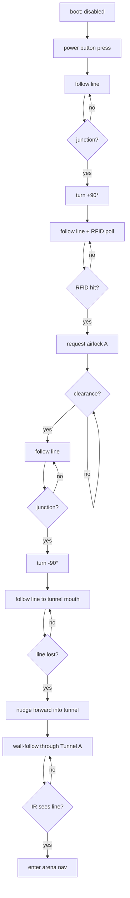
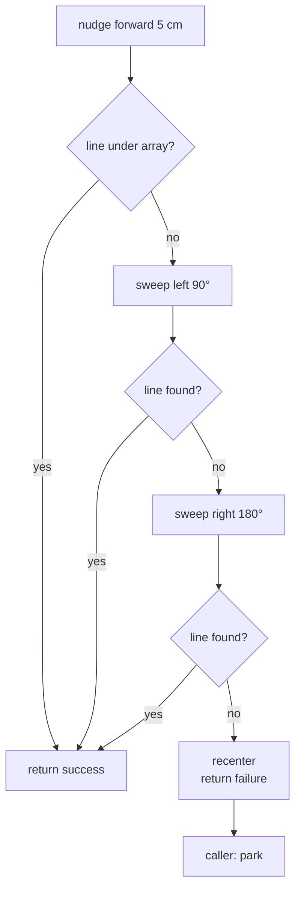
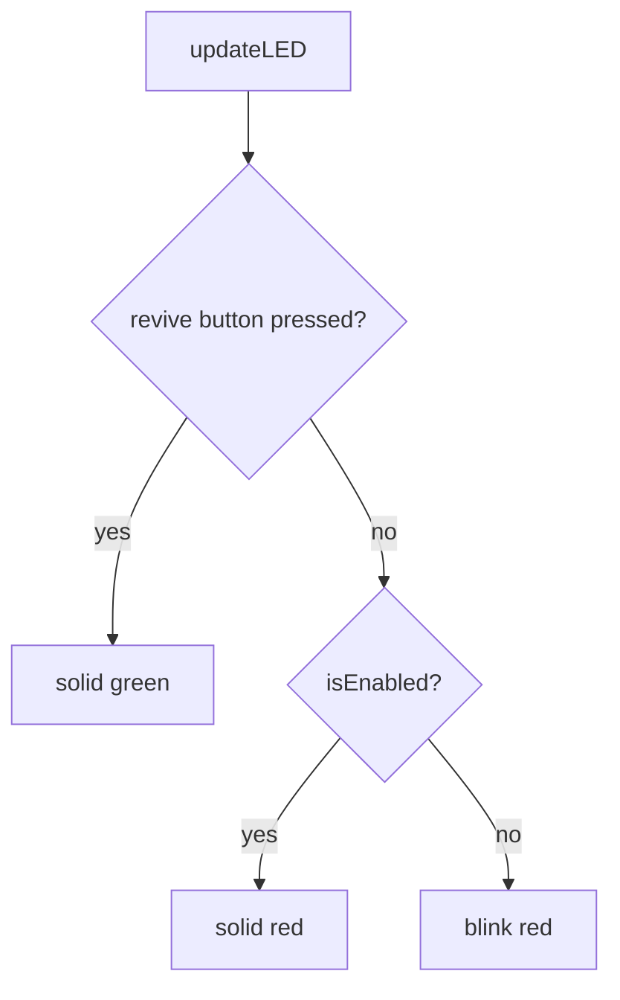
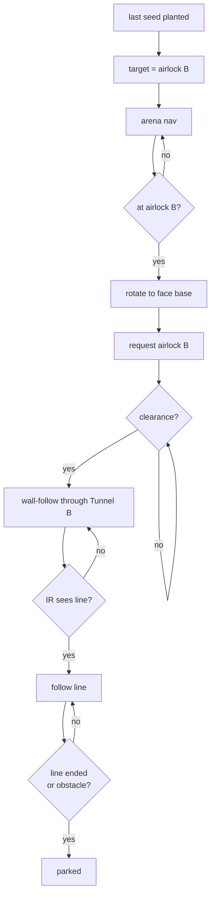
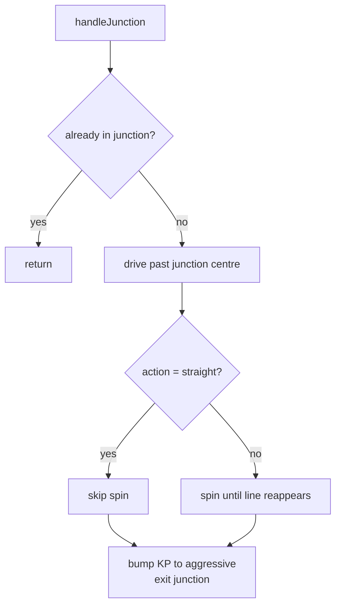

# Flowcharts

Mermaid diagrams for the key control flows. They render on GitHub, GitLab, and most markdown viewers with Mermaid support; the raw source is still readable as plain text otherwise.

## 1. Line following

`followLineBase()` is the line-follow tick used inside the base and in the line zone of the arena (rows 4–8).

Key behaviors:
- When the line is lost, motors are zeroed instead of holding the last PWM. Prevents drift past the line end.
- `LINE_FOLLOW_MIN_SPEED` is the floor for the slow-wheel side of the PID — below it the motor stalls and just buzzes.

## 2. RFID + planting decision

Runs on every arena tick. Scan the tag, ask the server what it is, act on the answer.

Notes:
- "Pick next target" prioritizes fertile-unplanted, then unknown, then everything else, by Manhattan distance.
- Once seeds are exhausted, the next target becomes airlock B (return path).

## 3. Emergency / kill switch

Four independent triggers can pause or stop the robot.

Behavioral split:
- An `isEnabled` drop **does not change `navState`**. Re-enable resumes whatever state was active before the pause.
- A forward obstacle auto-resumes the moment the obstacle clears (door opens / object moved).
- `NAV_BASE_RETURN` is special-cased in the obstacle gate: hitting something in front while returning ends the run.

## 4. Base exit sequence

From boot to arena nav.

## 5. Line-lost recovery (base only)

Triggered when `followLineBase()` returns `LINE_LOST` in a state where the line is *not* expected to end.

Total angular search range is ±90° from start. Each sweep stops the instant a line appears.

## 6. Status LED priority stack

`updateLED()` runs every tick.

Revive buttons are the only override. Otherwise the LED is solid red while enabled and blinks red while disabled.

## 7. Return-to-base sequence

After the last seed is planted, the planner targets airlock B and the run reverses.

Notes:
- Door-open detection in both tunnels watches the forward ultrasonic, not the clearance message. Clearance is for verification only.
- `BASE_RETURN` ends on whichever happens first: the line ending naturally, or an obstacle in front.

## 8. Junction handling (legacy)

`handleJunction()` is only used by the legacy `NAV_LINE_FOLLOW` test path. The state-machine path uses `baseTurnBlocking()` for base junctions and `NAV_POST_TAG_NUDGE` for arena turns instead — both are simpler and don't go through this function.

Kept for the test-mode path and for reference; production base-exit and arena flows do not use it.
